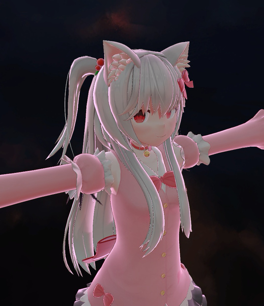

# 説明

VRChatでの特殊な状況でも望んだ動作をすることと、様々な表現を複数のシェーダーに分けず同じライティングで行うことを目指したトゥーンシェーダーです。

トゥーンシェーダーとしての基本的な機能に加え、作者が思いついた機能をいくつか設定可能です。

# 制作者

ほたてねこまじん🐾

https://twitter.com/HhotateA_xR

http://hhotatea.com

# 規約

・VRChatの仕様変更により本パッケージの機能が使えなくなった場合、製作者は責任を負いません。

・本商品はPC,WindowsのUnityで動作を確認しています。それ以外でのPlatformでの動作は保証しません。

・著作権は製作者に帰属します。

・本製品を使って発生した問題に対しては製作者は一切の責任を負いません。

・Unityでビルド後であれば連絡なしで再配布可能とします。(VRChatのアバター、ワールドのアップロードはビルドと同じ扱いと考えます)

・サンプルを除いたシェーダー本体は再配布可能とします。 (連絡不要ですが、連絡いただければいろいろと喜びます)

# 説明

シェーダープログラム本体をcgincludeファイルに分けていないのでシェーダーファイル単体で動作しますが、設定を支援するeditorファイルがあります。
editorファイルとshaderファイルを一緒にUnityにインポートすることをお勧めします。

### シェーダータグ

**ブレンドモード** : 透過の自動設定です ( Opaque-不透明, Transparent-半透明, Additive-加算, AdditiveTransparent-加算半透明)

**アルファカットアウト** : アルファがこの値以下の場合カットアウトします

**ステンシル設定** : ステンシルの自動設定です

**ステンシル値** : ステンシルのRef値です

**テッセレーション** : ポリゴン数を増やす設定です (非常に高負荷なので、注意(´・ω・`))

**Render Queue** : レンダーキューの設定です、ブレンドやステンシルの設定に合わせて設定してください (VRChatではこの設定は正常に動作しないことがあるそうです。シェーダーを編集することで、強制的に書き換えることができます。)

**ミラーカリング** : ミラーにモデルが映らないようにします

**カメラカリング** : 特定解像度のカメラにモデルが映らないようにできます

**Near Clip** : この距離よりモデルに近いとモデルが表示されなくなります

**Far Clip** : この距離よりモデルから離れるとモデルが表示されなくなります

**ノイズ** : だんだんと消える(現れる)ための設定です

---

### メインテクスチャ

**メインテクスチャ** : 基本的なテクスチャです

---

### メインテクスチャファクタ

**UVスクロール** : メインテクスチャをUVスクロールできます(wの値でかくかくした動きにできます)

**サブテクスチャ** : ポリゴンの背面や影の部分のテクスチャを上書きできます

**頂点カラー** : テクスチャの色に頂点カラーを掛け算します

**色変換** : メインテクスチャの色をHSV変換できます

モデル座標マスク : モデルの右半分,左半分のみ色変換する設定です (左右対称のUV展開をしているモデルなどに便利)

マスク : 色変換する部分のマスクです

イラスト風 : イラスト風のフィルタをかけられます

色サンプルから変換 : テクスチャの特定の色を別の色にする、のような設定ができます

 
**テクスチャ上書き** : メインテクスチャの一部に別のテクスチャを上書きできます (ロゴや服の一部のテクスチャ改変を想定しています)

モデル座標マスク : モデルの右半分,左半分のみ色変換する設定です (左右対称のUV展開をしているモデルなどに便利)

---

### グラブパス

**透明度をグラブパスに** : 透明度をTransparentとして処理する代わりにグラブパスとして処理します (アウトラインがあっても透明度が表現可能です)

**屈折率** : グラブパス部分の透明度です

**モザイク** : グラブパスにモザイク処理をします

**イラスト風** : グラブパスにイラスト風処理をします

**HSV色変換** : グラブパスにHSV色変換をかけます

**色収差** : RGBをずらして描画できます

---

### ライティング

**ノーマルマップ** : ノーマルマップ

**シャドウマップ** : R-メタリック,G-ラフネス,B-影をマップで指定できます

**仮想ディレクショナルライト** : ディレクショナルライトが存在しないワールドで完全に暗くならないための設定です

**仮想環境光** : グローバルイルミネーションが完全に暗くならないための設定です

**ライト色の平均化** : ライトの色にどの程度モデル色が影響されるかの設定です

**影の濃さ** : モデルに落ちる影の濃さ、キャラクターモデル等では低めの設定をお勧めします

**ライト方向の平均化** : グローバルイルミネーションが方向に依存せず平均化されたものになります

**ポイントライトの影響** : モデルに対するポイントライトの影響を制御できます

**ハーフランバート** : ランバートを強制的にシフトできます

**フラットシェーディング** : ポリゴンから計算した法線をノーマルとして計算します

---

### トゥーンシェーディング

**トゥーンシェーディング** : トゥーンシェーディングとフィジックベースなレンダリングを切り替えられます

**薄影** : 1段階目の影です

**濃影** : 2段階目の影です

**影にサブテクスチャをブレンド**　: 影の部分のテクスチャを変えられます

---

### マットキャップとリムライト

**マスク** : リムとマットキャップのマスクです

**リムカラー** : リムライトの色です

**シムシフト** : フレネルの値をずらせます

**マットキャップ** : マットキャップを設定できます、右側のメニューで乗算モードと加算モードを切り替えられます

### アウトライン

**アウトラインモード** : キャラモデルの表示にはNormalModeをおすすめします

**マスク** : アウトラインのいらない部分を黒色で指定してください

**太さ** : 1前後でちょうどいいように調節してあります

**テクスチャ** : アウトラインの部分にメインテクスチャと別のテクスチャを指定できます

**テクスチャブレンド** : アウトラインにメインテクスチャをブレンドできます

---

### エミッション

**マスク** : エミッションする部分をマスクできます

**エミッション** : エミッションのテクスチャを指定できます

**スクロール** : エミッションのエリアをスクロールします、wで速度を変えられます

**テクスチャスクロール** : エミッションテクスチャをスクロールできます

**太さ** : エミッションのエリアの太さを変えられます

---

### ワイヤーフレーム

**色** : ワイヤフレームの色です

**テクスチャブレンド** : ワイヤーフレームにメインテクスチャをブレンドします

**太さ** : ワイヤーフレームの太さです、仕様上1を超える値くらいで線が現れます

---

### パララックスマッピング

モデルの表面より奥にテクスチャがあるような表現ができます

**透明度をパララックスに** : 透明度をTransparentとして処理する代わりにパララックスマッピングをします

**マスク** : パララックスマッピングする部分をマスクで指定します

**パララックテクスチャ** : パララックスマッピングのテクスチャを指定します

**深さ** : パララックスマッピングの深度を指定します

---

### 頂点シェーダー

**メモリ** : テクスチャのRGBをxyzとして頂点移動させます

**ポリゴンベースか頂点ベースか** : メモリによる頂点の動きをポリゴンベースに切り替えられます

**爆発** : ポリゴンを法線方向に飛ばせます、ノイズを混ぜることでランダムなポリゴンが飛びます

**重力** : 飛んだポリゴンが重力に引かれます

**回転** : ポリゴンが視線に直行する軸で回転します、ノイズを混ぜることでランダムなポリゴンが回転します

**スケール** : ポリゴンを収縮します、ノイズを混ぜることでランダムなポリゴンが収縮します

**分身**

分身数 : 1~8の中で分身の数を増減できます

分身方向 : 分身が現れる位置です

**GPUパーティクル**

パーティクルファクター : ポリゴンをパーティクル化します

カラー : パーティクルの色です

テクスチャブレンド : メインテクスチャの色をパーティクルに乗算します

サイズ : パーティクルのサイズです

**変換行列**

ワールド変換行列 : モデルのワールド座標にかかわらず一定の位置にモデルが現れるようになります

ビュー変換行列 : カメラの位置にかかわらずモデルが見えるようになります

ビルボード : モデルがカメラの方向に固定されます

### フェイクブルーム

**ZWrite** : ブルーム部分にZを書き込むか、基本的にはOffでOKです

**ベース** : キャラモデルの表示にはNormalModeをおすすめします

**マスク** : ブルームの発行部分をマスクできます

**メインテクスチャノーマル** : ブルームにメインテクスチャを乗算するときにメインテクスチャを正規化します

**モード** : ブルーム部分のブレンドを自動設定します

**テクスチャ** : ブルームの光具合を指定するテクスチャです、ここに任意のテクスチャを指定することでファー(毛)のような表現ができます

**テクスチャブレンド** : ブルーム部分にメインテクスチャをブレンドします

**長さ** : ブルーム(ファー)の長さです

**明るさ** : ブルーム(ファー)の明るさです

**Knee** : ブルーム(ファー)のぼかしです

**風の強さ** : ブルーム(ファー)に対する疑似的な風の強さです

**重力** : ブルーム(ファー)に対する重力です

